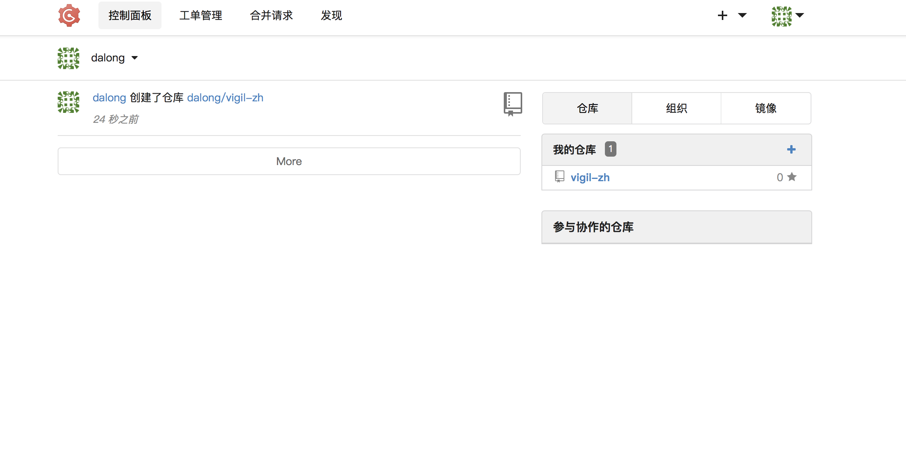

# gogs docker-compose build

## how to run

```bash
docker-compose up -d
```

## config gogs

```bash
after run open http://localhost:10080
data source mysql:3306 && input password && username
```

## access the web page

```bash
http://localhost:10080
```

## some images


